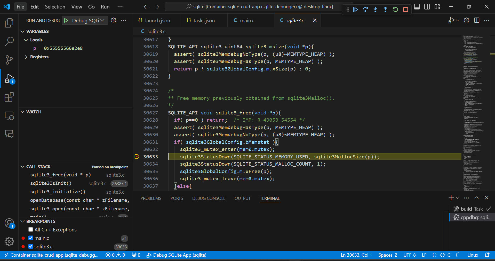

# Debugging SQLite3 in VS Code

## Steps to Get Started

### 1. Clone the Repository
```git clone https://github.com/FarjadAkbar/debugging-sqlite3```


### 2. Build Docker Image
Run the following command to build the Docker image:

```docker build -t sqlite-crud .```


### 3. Start the Docker Container
Use the command below to start the Docker container:

```docker run -it --name sqlite-debugger sqlite-crud-app```


### 4. Install Required Extensions in VS Code
Make sure to install these VS Code extensions for debugging:

- [C/C++ Extension](https://marketplace.visualstudio.com/items?itemName=ms-vscode.cpptools)
- [Remote - Containers](https://marketplace.visualstudio.com/items?itemName=ms-vscode-remote.remote-containers)

### 5. Open the Project in the Dev Container
To open the project inside the development container:

- Press `Ctrl + Shift + P` in VS Code
- Type `"Remote-Containers: Reopen in Container"` and select it

The Dev Container will automatically build using the provided `Dockerfile`.


### 6. Set Breakpoints and Start Debugging
- Set breakpoints in your code as needed.
- Run the build task in VS Code using `Ctrl + Shift + B`.
- Start debugging by pressing `F5`.

The debugger will attach, and you can step through the code line by line to inspect variables and analyze the flow.


